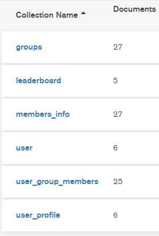

# Produce 404
Create your own K-pop girl group! A React app served by a Node.js backend with a REST API. Connects to a MongoDB database, the Spotify API, and the YouTube API.

This is version 2 of this project. Initially, this was my first ever web development creation. I learned a lot, but it was pretty full of mistakes. Therefore, I am now rebuilding it in order to improve even more.

## Improvements (planned so far)

### Server

- descriptive docstrings
- use of HTTP status codes
- error handling
- password hashing

### Client

- functional components
- bootstrap
- sass/scss
- form validation 

## Features

### Server side CGI components

The React app is hosted on an Express server, which also hosts the API for the app. When the server starts, it gets an authorization token from the Spotify API to be used for requests. This token is refreshed when it expires. The server's API handles all database requests, including login/registration services and access to the idol database. The server also calculates the score for a performance given a user's group and song choice. Using this song choice, the server contacts the YouTube search API and returns the first video result for the song. This allows the user's chosen song to be played in the client's embedded player.

### Database tier design, data, usage

The database is hosted on the MongoDB Atlas cloud hosting service. The database is accessed using a special url stored on the server.

The collections in the database are as follows:

- `groups` - real life group names, company names, spotify artist ids
- `leaderboard` - leaderboard entries
- `members_info` - individual idol information
- `user` - user login info
- `user_group_members` - idols added to each custom group
- `user_profile` - user profile info

### Leaderboard features

The entry at #1 on the leaderboard will determine the song initially played by the embedded YouTube video player at the top of the page. Selecting any other song on the list will replace the currently playing song with the chosen one.

### Scoring algorithm

Each idol has three skill values between 1-4 (inclusive). These skills are `sing`, `rap`, and `dance`. The skills for a group are the average of its members' skills (`sing_average`, `rap_average`, `dance_average`). The Spotify API returns specific features for a given song. The features used for score calculation are `speechiness`, `energy`, and `danceability`.

The formula used to devise performance scores is:

`(([sing_average * (1 - speechiness)] + [rap_average * energy ] + [dance_average * danceability]) * 1000000) / 6`