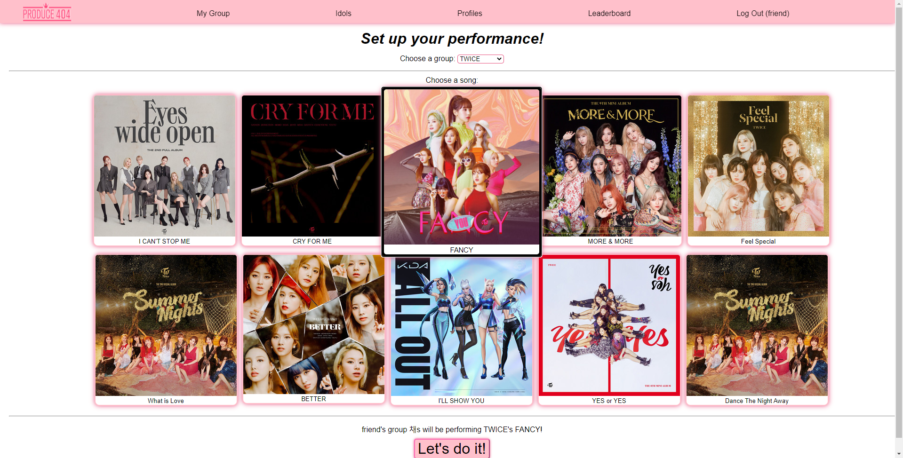
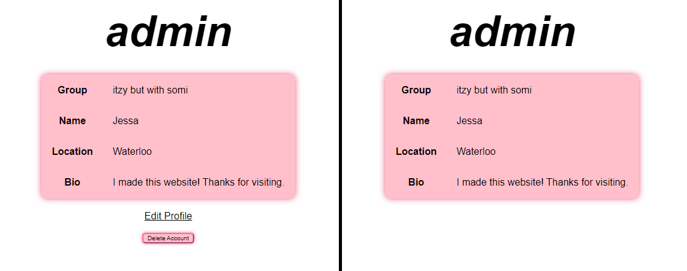
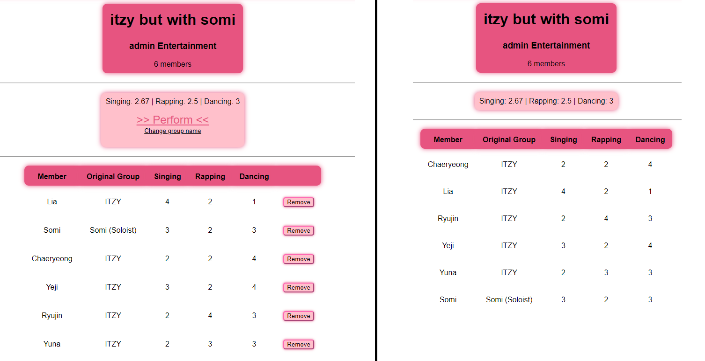
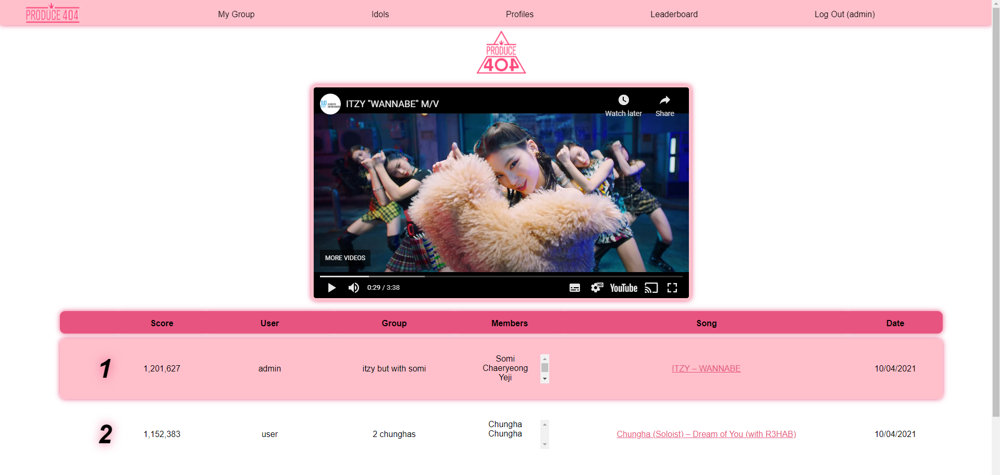
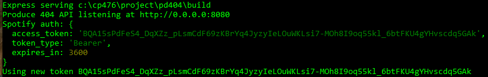
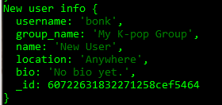
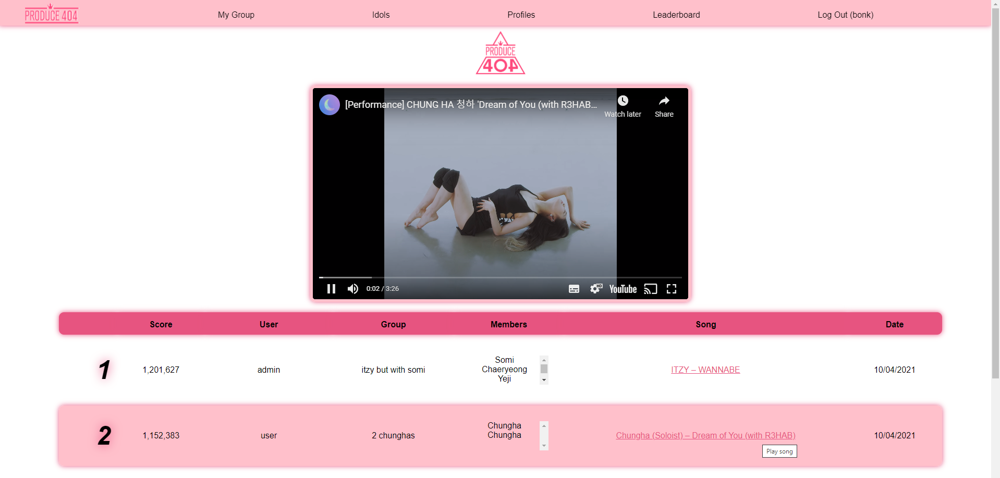

# Produce 404
Create your own K-pop girl group! A React app served by a Node.js backend with a REST API. Connects to a MongoDB database, the Spotify API, and the YouTube API.

This is my first ever full-sized web development project. I learned a lot along the way, but there is a lot I would improve on and fix if I were to make this again. It's a little messy, but the functionality's all there. I'm pretty proud of what I was able to create for my first web app.

## How to use
[Produce 404 can be found on Heroku.](https://produce404.herokuapp.com/)
Please note that the website will take a short moment to load once opened.

If you want to launch the app locally, follow these steps.

1. `cd` to the `/pd404` directory
2. `npm run build`
3. `npm start`
4. open `http://localhost:8080/`

## Functionality

### Client side component and UI

The UI is simple and user friendly. Data that is returned from the server is presented in a clean and consistent interface.

Profile and user group pages display extra links and buttons if the owner is logged in. If viewing another person's pages, extra links and buttons are disabled. The images below demonstrate a page when one is the owner, and the same page when one is not the owner.

Some components are able to be interacted with. Aside from buttons and input fields, there are also decorative aspects, most notably the leaderboard entries and song buttons which are highlighted when they are hovered over.

### Server side CGI components

The React app is hosted on an Express server, which also hosts the API for the app. When the server starts, it gets an authorization token from the Spotify API to be used for requests. This token is refreshed when it expires. The server's API handles all database requests, including login/registration services and access to the idol database. The server also calculates the score for a performance given a user's group and song choice. Using this song choice, the server contacts the YouTube search API and returns the first video result for the song. This allows the user's chosen song to be played in the client's embedded player.

### Database tier design, data, usage

The database is hosted on the MongoDB Atlas cloud hosting service. The database is accessed using a special url stored on the server.

The collections in the database are as follows:

- `groups` - real life group names, company names, spotify artist ids
- `leaderboard` - leaderboard entries
- `members_info` - individual idol information
- `user` - user login info
- `user_group_members` - idols added to each custom group
- `user_profile` - user profile info

### New features and tools

The entry at #1 on the leaderboard will determine the song initially played by the embedded YouTube video player at the top of the page. Selecting any other song on the list will replace the currently playing song with the chosen one.

### Problem solving algorithms

Each idol has three skill values between 1-4 (inclusive). These skills are `sing`, `rap`, and `dance`. The skills for a group are the average of its members' skills (`sing_average`, `rap_average`, `dance_average`). The Spotify API returns specific features for a given song. The features used for score calculation are `speechiness`, `energy`, and `danceability`.

The formula used to devise performance scores is:

`(([sing_average * (1 - speechiness)] + [rap_average * energy ] + [dance_average * danceability]) * 1000000) / 6`

### Efficiency and robustness

The server-side handles all external database and API requests for security and to reduce client load. The frontend and backend are handled by the same Express server, so requests from client to server will be handled quickly.

## References used
A lot of websites were used to help me make this.

[Routing with Express](https://expressjs.com/en/guide/routing.html)

[Express parameters](https://www.digitalocean.com/community/tutorials/use-expressjs-to-get-url-and-post-parameters)

[React props](https://stackoverflow.com/questions/55363689/how-and-where-to-pass-json-data-as-a-prop-when-creating-components)

[React router](https://www.freecodecamp.org/news/react-router-in-5-minutes/)

[React components](https://reactjs.org/docs/react-component.html)

[React logins](https://www.digitalocean.com/community/tutorials/how-to-add-login-authentication-to-react-applications)

[Session storage](https://developer.mozilla.org/en-US/docs/Web/API/Window/sessionStorage)

[React forms](https://reactjs.org/docs/forms.html)

[React onClick](https://upmostly.com/tutorials/react-onclick-event-handling-with-examples)

[React event handling](https://reactjs.org/docs/handling-events.html)

[CSS Flexbox](https://css-tricks.com/snippets/css/a-guide-to-flexbox/)

[Spotify authorization](https://developer.spotify.com/documentation/general/guides/authorization-guide/)

[Spotify client credentials](https://github.com/spotify/web-api-auth-examples/blob/master/client_credentials/app.js)

[Axios requests](https://blog.logrocket.com/how-to-make-http-requests-like-a-pro-with-axios/)

[CSS dropdown](https://www.w3schools.com/howto/howto_css_dropdown.asp)

[YouTube search API](https://dev.to/aveb/making-your-first-get-request-to-youtube-search-api-4c2f)
